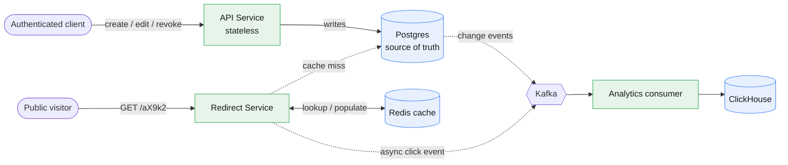
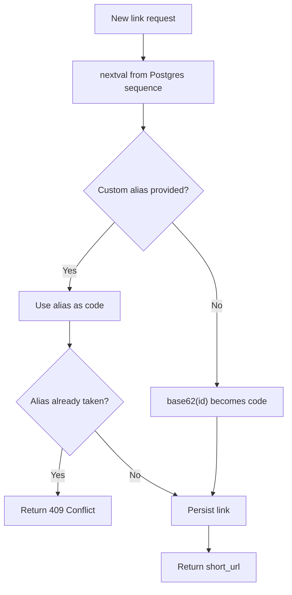
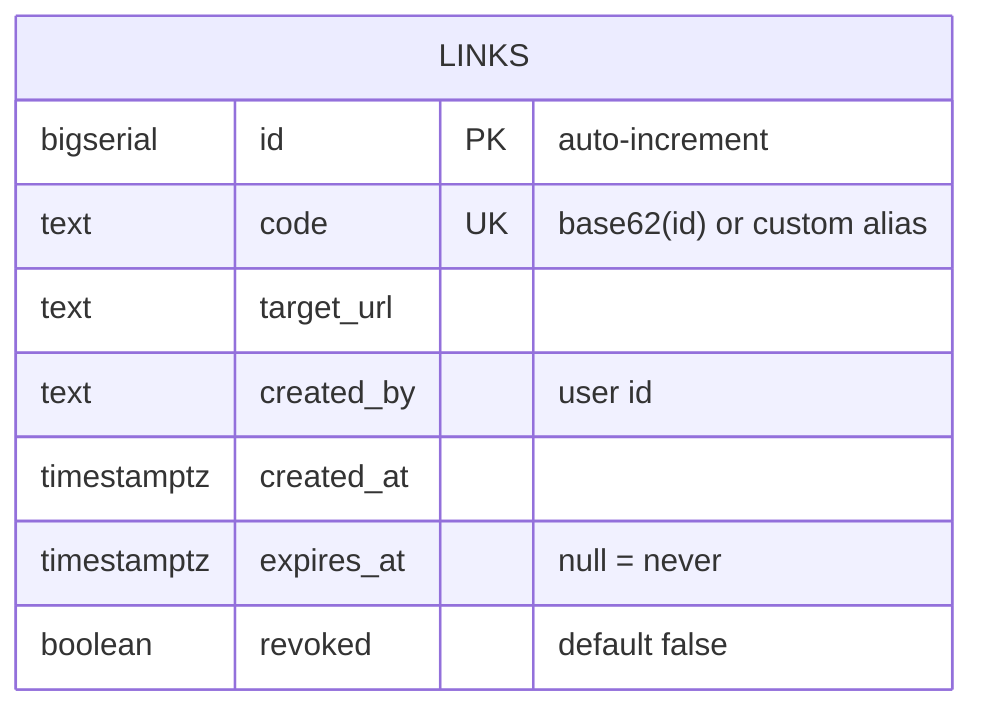
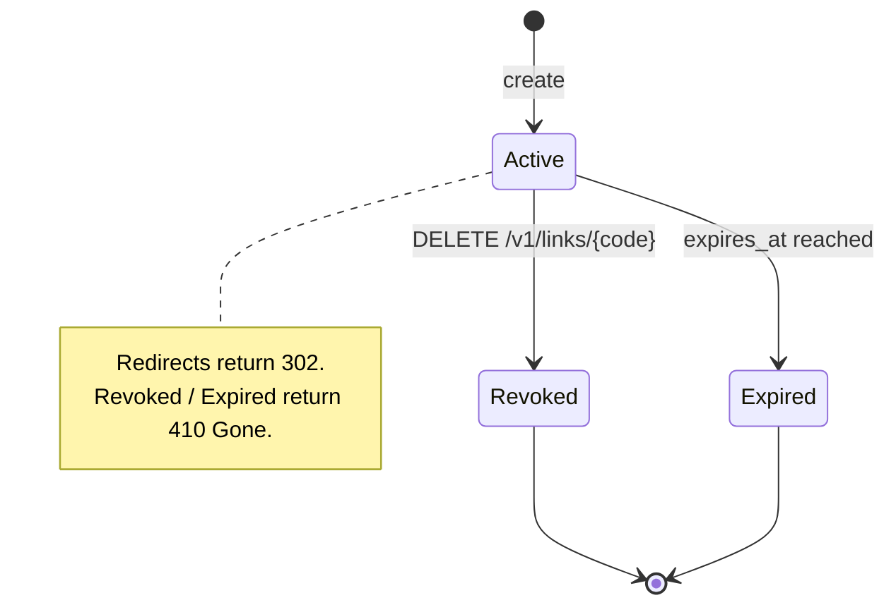
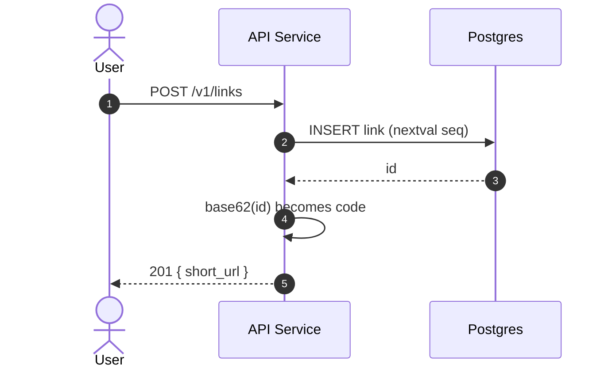
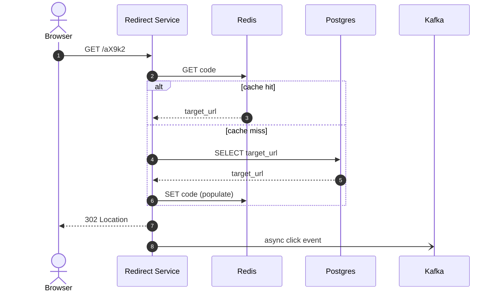
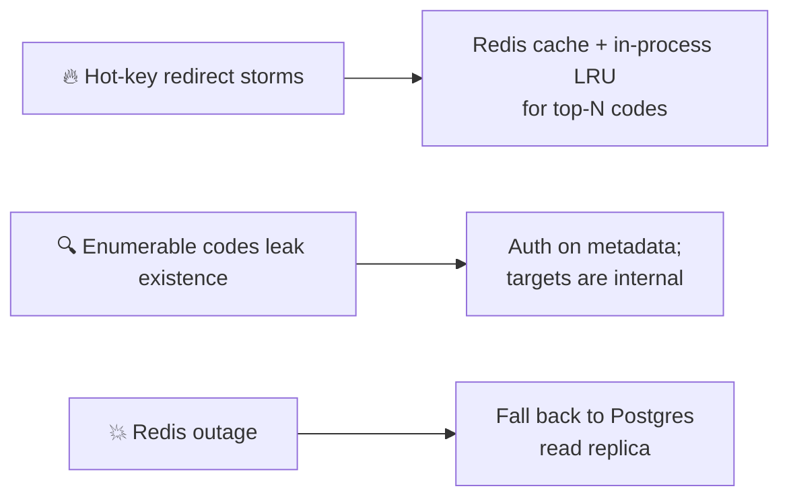
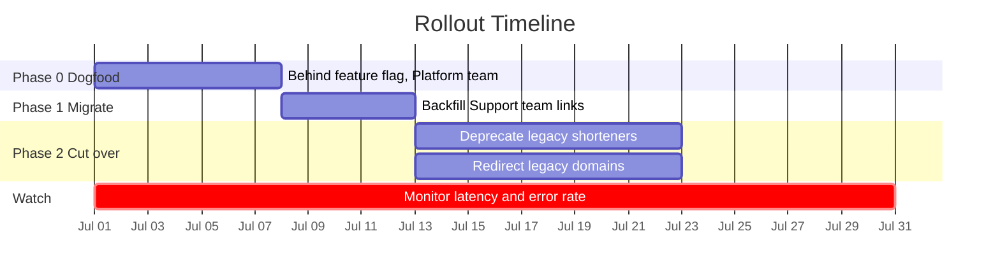

# 🔗 Design Doc: Link Shortener Service ("Snip")

> A stateless service that turns long URLs into short, shareable links
> (`snip.co/aX9k2`), redirects fast, and tracks clicks.

| | |
|---|---|
| **Author** | Jane Doe (@jdoe) |
| **Reviewers** | A. Kumar, M. Chen, Platform Team |
| **Created** | 2026-06-10 |
| **Last updated** | 2026-06-17 |
| **Tracking issue** | [PLAT-1428](#) |

---

## 1. Summary

We want an internal service that turns long URLs into short, shareable links and
redirects users to the original destination. It needs to handle **~5k redirects/sec
at p99 < 50ms**, support custom aliases, and expose click analytics. This doc
proposes the architecture, data model, and rollout plan.

Keep this short enough that a busy reviewer understands the whole thing in 30
seconds. Everything below is detail.

---

## 2. Context & Problem

What's happening today and why it's worth changing:

- 📧 Marketing and Support paste raw URLs into emails and chat; they're ugly,
  break on wrapping, and we have no visibility into click-through.
- 🧩 Three teams have each built a half-finished shortener. None is maintained.
- 🚫 There's no central place to revoke or expire a link after it's shared.

State the problem as a problem, not as "we should build X." The solution comes later.

---

## 3. Goals & Non-Goals

Being explicit here prevents scope creep and review thrash.

**✅ Goals**

1. Create short links (auto-generated or custom alias) via API and a small UI.
2. Redirect with **p99 latency < 50ms** at 5k req/s.
3. Per-link click counts and basic referrer breakdown.
4. Link expiration and manual revocation.

**🚧 Non-Goals**

- Public/anonymous link creation (internal auth only, for now).
- A/B testing or link rotation.
- Full marketing-attribution analytics — we emit raw events, BI owns dashboards.

---

## 4. Proposed Solution

A stateless **API service** handles writes (create/edit/revoke) and persists to
**Postgres** (source of truth). A separate, highly-cached **redirect service**
handles the hot read path, backed by **Redis** with Postgres as fallback. Short
codes are generated by base62-encoding a monotonic ID from a sequence, which
guarantees uniqueness without collision checks.

### 4.1 Architecture



### 4.2 Short-code generation

We use a Postgres sequence and base62-encode the integer. At `62^5 ≈ 916M`
codes for length 5, this is sufficient for years at projected volume, and we grow
to 6 chars automatically when the integer crosses the threshold. No collision-retry
loop is needed because IDs are unique by construction.



> *Alternative considered: random codes with collision check — rejected, see §7.*

---

## 5. Data Model



Click events are **not** stored in Postgres; they go to Kafka → ClickHouse to keep
the write path cheap and the OLTP store small.

### Link lifecycle



---

## 6. API Design

| Method | Path | Description |
|---|---|---|
| `POST` | `/v1/links` | Create a link. Body: `{target_url, alias?, expires_at?}` |
| `GET` | `/v1/links/{code}` | Fetch metadata (auth'd) |
| `DELETE` | `/v1/links/{code}` | Revoke a link |
| `GET` | `/{code}` | Public redirect (302) |

**Create example**

```http
POST /v1/links
Content-Type: application/json

{ "target_url": "https://example.com/very/long/path", "alias": "launch" }

→ 201 Created
{ "code": "launch", "short_url": "https://snip.co/launch", "expires_at": null }
```

### Create flow



### Redirect flow (hot path)



Redirects return `302` (not `301`) so we don't lose the ability to revoke or
collect analytics — browsers cache `301` aggressively.

---

## 7. Alternatives Considered

The section that earns trust with reviewers. Show you looked at other options.

| Option | Pros | Cons | Verdict |
|---|---|---|---|
| Random codes + collision check | No sequence dependency | Retry loop under contention; harder to reason about | ❌ Rejected |
| Hashing the URL (MD5 prefix) | Idempotent for same URL | Collisions, can't customize, leaks structure | ❌ Rejected |
| Off-the-shelf SaaS shortener | Zero build cost | Data leaves our perimeter; no custom auth | ❌ Rejected (compliance) |
| **Sequence + base62** | Collision-free, simple, cacheable | Codes are guessable/enumerable | ✅ **Chosen** |

---

## 8. Risks & Mitigations



| Risk | Mitigation |
|---|---|
| **Hot-key redirect storms** (one viral link) | Redis caches the mapping; add a short in-process LRU for the top N codes. |
| **Enumerable codes** leak link existence | Acceptable: targets are internal, redirect is intentionally public. Revisit if opened externally. |
| **Redis outage** | Redirect service falls back to Postgres read replica — degraded latency, no downtime. |

---

## 9. Rollout Plan



**📊 Metrics to watch:** redirect p99 latency, cache hit ratio, error rate, create-API 5xx rate.

**↩️ Rollback:** feature flag off + legacy services kept warm for two weeks.

---

## 10. Open Questions

- ❓ Do we need rate limiting on link creation per user? (Likely yes — follow-up.)
- ❓ Should custom aliases be namespaced per team to avoid land-grabs?
- ❓ Retention policy for click events in ClickHouse — 90 days or 1 year?

---

## 11. Appendix

Links to the prototype branch, load-test results, related docs, and any diagrams
that didn't fit above.